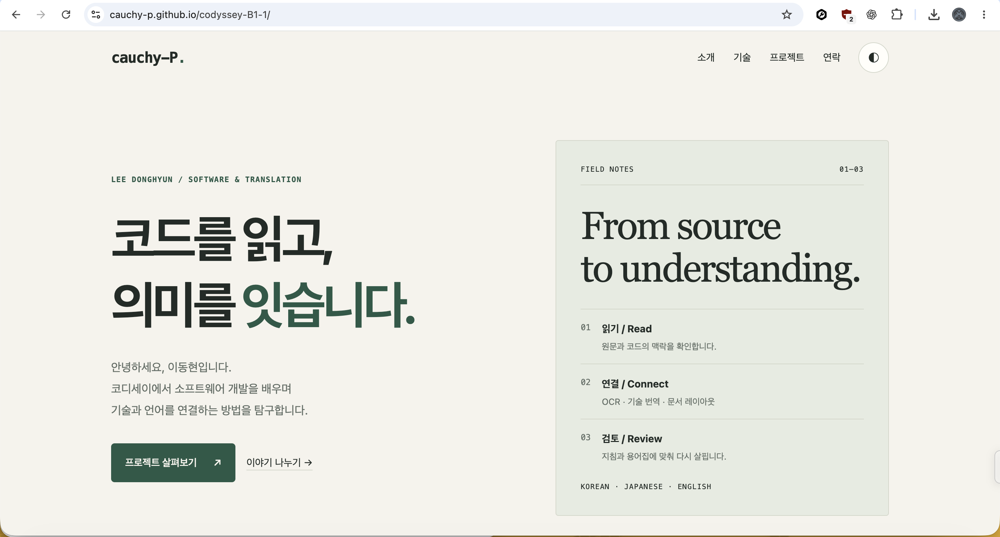
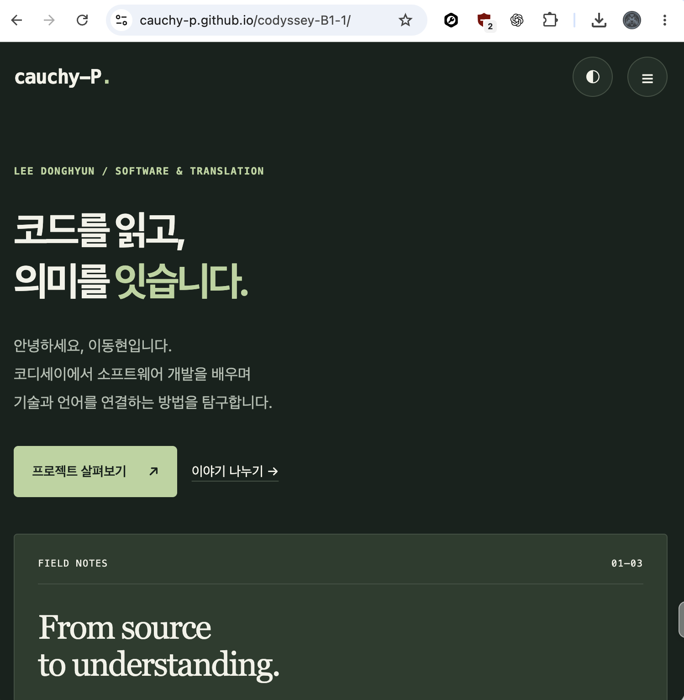

# 이동현 · cauchy-P — 코디세이 B1-1

순수 HTML, CSS, JavaScript로 만든 자기소개 포트폴리오입니다. 공개 GitHub 프로필과 공개 프로젝트 README를 바탕으로 개발·기술 번역·OCR에 대한 관심과 학습 기록을 소개합니다.

## 실행

제출용 ZIP을 풀면 `index.html`, `css/`, `js/`, `images/`가 프로젝트 루트에 놓입니다.

1. VS Code에서 압축을 푼 폴더를 엽니다.
2. 추천 확장인 Live Server를 설치합니다.
3. `index.html`을 우클릭하여 **Open with Live Server**를 선택합니다.

대안: 같은 폴더에서 `python3 -m http.server 8000`을 실행하고 `http://localhost:8000`에 접속합니다.
이 제작용 소스 저장소에서는 웹 파일이 `dist/`에 있으므로 `python3 -m http.server 8000 --directory dist`로 실행합니다. 빌드나 npm 설치가 필요하지 않습니다.

## 사용 기술

HTML5, CSS3, Vanilla JavaScript(ES6+), GitHub REST API, localStorage, Intersection Observer. 외부 프레임워크·CSS 라이브러리를 사용하지 않습니다. 테스트 스크립트의 Node.js 모듈은 개발 검증 도구이며 웹페이지에서 실행하거나 로드하지 않습니다.

## 구성

- `index.html`: Hero, About, Skills, Projects, Contact, Footer
- `css/style.css`: 색상·폰트·간격 변수, 모바일 퍼스트 레이아웃, 라이트/다크 모드
- `js/main.js`: 이벤트, 상태, 렌더링, API, 입력 검증
- `images/`: 이미지 출처 안내 및 제출 스크린샷 저장 위치
- `.vscode/extensions.json`: Live Server 추천
- `.github/workflows/pages.yml`: GitHub Pages 배포 자동화
- `MISSION_REVIEW.md`: 미션 정리·평가 체크리스트·예제 비교

## 기능과 기준값

| 항목 | 구현 |
| --- | --- |
| 모바일 메뉴 | 버튼 클릭으로 active 토글, 앵커 이동·외부 클릭·Escape·화면 폭 변경 시 닫기 |
| 부드러운 이동 | 앵커 + CSS scroll-behavior, 고정 헤더 높이를 위한 scroll-padding-top |
| 헤더 배경 | scrollY ≥ 60px |
| 맨 위로 버튼 | scrollY ≥ 300px, 클릭하면 top: 0 |
| 등장 애니메이션 | Intersection Observer threshold: 0.2, 한 번 나타난 후 관찰 해제 |
| 반응형 | 모바일 기본 → min-width: 768px → min-width: 1024px |
| 테마 | 저장값 우선, 저장값이 없으면 시스템 테마. 수동 선택 후 localStorage 유지 |
| 프로젝트 | 공개 저장소 API, 언어 필터, 로딩·성공·오류·빈 상태와 재시도 |
| API 예외 | response.ok 검사, 403/429/404, 네트워크 오류, 응답 형식 검증, 15초 타임아웃 |
| 페이지네이션 | 한 번에 100개, 마지막 페이지까지 호출 |
| 문의 폼 | 이름·이메일·메시지 필수값, 공백, 이메일 형식 검증, 필드별 오류와 성공 메시지 |
| 접근성 | label/for-id, 의미 있는 alt, aria-live, aria-invalid, 키보드 포커스, 모션 감소 설정 |

프로젝트 API: `https://api.github.com/users/cauchy-P/repos?sort=updated&per_page=100&page=1`
API 목록은 실제 응답으로 렌더링합니다. 상단 대표 프로젝트 2개는 공개 README를 바탕으로 작성한 정적 소개이며, API 실패 시에도 읽을 수 있습니다. 언어가 없는 저장소는 '미지정', 포크 저장소는 'Fork'로 표시합니다.
인증 없는 GitHub API에는 요청 제한이 있으므로 반복 새로고침을 피하세요. 제한 응답은 오류 화면으로 표시됩니다. 토큰을 프런트엔드 코드에 넣지 않습니다.

## 상태 → 렌더링 설명

| 이벤트 | 상태 | 화면 반영 |
| --- | --- | --- |
| 테마 버튼 click | state.theme | renderTheme → data-theme, CSS 변수, 버튼 접근성 속성 |
| 메뉴 버튼 click | state.menuOpen | renderMenu → active 클래스와 aria-expanded |
| API 요청·재시도 | state.projects.status/items/error | renderProjects → 안내·카드·재시도 버튼 |
| 언어 버튼 click | state.projects.language | filter → map → 카드 HTML |
| 폼 input/submit | state.form.values/errors/success | renderForm → 입력란 오류·성공 메시지 |

`querySelector`로 요소를 찾고 `addEventListener`로 이벤트를 연결합니다. 이벤트에서 상태를 바꾼 뒤 render 함수를 호출합니다. 프레임워크가 자동 렌더링하지 않으므로 상태 변경 후 render 호출을 빠뜨리지 않아야 합니다.

Flexbox는 내비게이션처럼 한 축에서 항목을 배치할 때 사용했습니다. Grid는 카드의 행·열을 함께 배치할 때 사용했습니다. `repeat(auto-fit, minmax(min(100%, 280px), 1fr))`는 화면에 맞춰 열 수를 바꾸고 좁은 화면에서도 최소 폭 때문에 넘치지 않도록 합니다.

시맨틱 태그는 영역의 역할을 전달합니다. main은 핵심 콘텐츠, section은 주제별 영역, article은 독립적으로 읽을 수 있는 카드, nav는 주요 이동 링크입니다.

화살표 함수는 이벤트 콜백과 변환 함수에, 구조분해는 API 객체에서 필요한 필드를 꺼낼 때 사용합니다. map은 저장소 배열을 카드 문자열로, filter는 선택 언어의 목록으로 변환하고, forEach는 입력란과 버튼에 같은 처리를 적용합니다. 외부 문자열은 escapeHTML 후 innerHTML에 넣습니다.

fetch는 HTTP 403/404에도 자동으로 예외를 던지지 않으므로 response.ok를 직접 검사합니다. 실패하면 throw하고 catch에서 error 상태를 기록한 뒤, finally에서 타이머 정리와 렌더링을 수행합니다.

## 문의 폼의 범위

이 과제의 필수 범위에 맞춰 입력 검증과 성공 메시지를 구현했습니다. Formspree/EmailJS 전송은 선택 과제이며 구현하지 않았습니다. '입력 검증에 성공했습니다'는 실제 전송 성공을 뜻하지 않습니다. 폼 입력값은 외부로 전송하거나 저장하지 않습니다. 실제 문의는 공개 프로필에 있는 이메일 링크를 이용합니다.

## 검증 결과

2026-09-10: JavaScript 구문 검사와 HTML 정적 검사 통과. DOM을 모사한 Node.js 실행에서 17개 동작 그룹 통과: 성공 응답/HTML 이스케이프, 테마 저장·복구, 메뉴 토글, 스크롤 기준값·맨 위 이동, 빈 입력·이메일·정상 폼·수정 후 재검증, API 빈 상태·403/재시도·통신 실패·응답 형식 오류·페이지네이션·로딩 상태·언어 필터.

이는 Chrome에서 실제 배치·렌더링을 확인한 결과가 아닙니다. 외부 아바타 로딩, 모바일 화면 배치, 실제 GitHub API의 브라우저 호출, Intersection Observer의 실제 표시와 아래 제출 스크린샷은 최종 브라우저 확인이 필요합니다.

## GitHub Pages 배포와 제출 — 완료

### 최종 브라우저 체크리스트

- [ ] Chrome 데스크톱에서 모든 섹션과 앵커 이동 확인
- [ ] 모바일 폭 375px에서 가로 넘침과 메뉴 확인
- [ ] 태블릿 768px 및 데스크톱 1024px 이상에서 레이아웃 확인
- [ ] 다크 모드로 바꾼 뒤 새로고침해 설정 유지 확인
- [ ] 스크롤 헤더, 맨 위 버튼, 등장 애니메이션 확인
- [ ] 실제 GitHub 프로젝트 목록 및 언어 필터 확인
- [ ] DevTools의 요청 차단으로 오류 UI와 재시도 확인
- [ ] 빈 이름·틀린 이메일·정상 입력에 대한 폼 상태 확인
- [ ] `images/desktop.png`, `images/mobile.png`, `images/dark.png` 캡처 추가
- [ ] README에 실제 스크린샷 삽입
- [ ] 저장소 URL과 GitHub Pages URL 제출

스크린샷은 아직 생성하지 않았습니다. 없는 이미지 링크를 완료된 증거처럼 삽입하지 않았습니다.

- 저장소: https://github.com/cauchy-P/codyssey-B1-1
- 배포 사이트: https://cauchy-p.github.io/codyssey-B1-1/

### 제출 스크린샷

## 콘텐츠 출처

- https://github.com/cauchy-P/cauchy-P/blob/11800831e92463f3084bc41d52d594badc4e14f1/README.md
- https://github.com/cauchy-P/codyssey-E3/blob/c1cea546197273577eb6834ce598d732ad238c50/README.md
- https://github.com/cauchy-P/codyssey-E2/blob/657c807825879933209a39dd857232a042c86b4f/README.md
- https://github.com/cauchy-P/codyssey2-E1/blob/e81e14c2690f8383844d07bc2269e6fc0b574cc4/README.md

확인된 공개 내용만 사이트에 사용했습니다. 외국어 점수와 학력은 본인의 공개 프로필 기재 사항이며 별도의 자격 검증을 수행한 것은 아닙니다. 예제의 코드를 복사하지 않고 요구사항에 맞춰 새로 구현했습니다.
